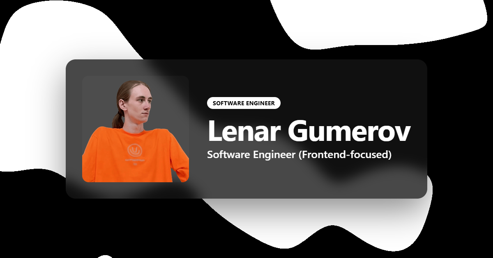

# Lenar Gumerov — Interactive CV

Live: **[lenargum.me](https://lenargum.me/)**

Personal CV/resume site built with Astro + React. Animated WebGL noise field, multi-profile content (`/`, `/react/`, `/vue/`, `/fullstack/`), full RU/EN, build-time PDF and social-card generation, mobile hamburger menu, custom design system.



---

## ✨ Highlights

- **WebGL2 noise background** — 3D simplex noise on a fullscreen triangle, cursor-trail "ink cuts" with eased pointer, looping shader for seamless OG previews, mobile touch support.
- **Profile switching** — same data tree, different curated views: `all` (everything), `react`, `vue`, `fullstack`. Each profile has its own URL, OG card, and PDF.
- **i18n** — EN at root, RU under `/ru/`. Lang switcher is a regular `<a>` link that navigates to the mirror URL.
- **Build-time PDF generation** — Puppeteer renders each `/pdf/{lang}/{profile}/` route at A4 and writes `public/downloads/LenarGumerov_<spec>[_RU].pdf`. PDF Modal links to the real file (no print dialog).
- **Build-time OG cards** — Astro route `/og/{lang}/{profile}/` rendered to PNG. Each social share gets a profile-tailored preview.
- **QR generation** — pure-JS pipeline writes square-anchor SVG QRs into `public/qr/`, embedded in the PDF route.
- **Mobile-first chrome** — hamburger overlay (full-screen, `.cv-card`-styled panel) consolidates profile / language / PDF / lava-mode toggle. Floating chrome on desktop only.
- **Lava-mode screensaver** — toggle hides the card so the noise field takes the whole viewport. Tap the hamburger to exit (taps on the noise itself drive the cursor-trail animation, not the dismiss).
- **Design tokens** — colours, type scale, radii, spacing in `src/design-system/tokens.css`. Reused across web + PDF + OG.

## 🛠️ Tech stack

- **[Astro 5](https://astro.build/)** — static site generation, route-per-profile via `getStaticPaths`
- **[React 19](https://react.dev/)** — interactive islands (header, content, switchers, PDF modal)
- **[TypeScript](https://www.typescriptlang.org/)** — strict-mode types throughout
- **[Tailwind CSS 3](https://tailwindcss.com/)** — utilities + custom design tokens
- **[Motion](https://motion.dev/)** — toast / modal animations
- **WebGL2 + GLSL** — `NoiseBackground.tsx` simplex noise shader, looping mode, capture mode
- **[Puppeteer](https://pptr.dev/)** — headless Chromium for PDF + OG rendering
- **[qrcode](https://github.com/soldair/node-qrcode)** — QR codes (custom SVG renderer with sharp finder anchors)

## 🚀 Getting started

```bash
pnpm install
pnpm dev          # http://localhost:4321/
```

Other scripts:

```bash
pnpm build        # static build → dist/
pnpm preview      # preview the built site

pnpm qr           # regenerate QR SVGs (8 files: 2 langs × 4 profiles)
pnpm pdf-gen      # build + render 8 PDFs into public/downloads/
pnpm og-gen       # build + render 8 OG cards into public/og/
pnpm og-apng      # render animated APNG variants of OG cards (experimental)
pnpm assets-gen   # qr + pdf + og in one go (full pre-deploy refresh)
```

## 🎨 Background animation (WebGL)

Lives in `src/components/NoiseBackground.tsx`.

- **Shader** — fullscreen triangle, 3D simplex noise (Ashima/Stegu) thresholded into soft "bubbles".
- **Cursor cuts** — recent pointer positions are pushed into a uniform array (`u_cuts`); each fragment near a cut subtracts brightness, producing an ink-trail effect that decays with `CUT_LIFETIME_MS` and `MAX_CUTS_JS`.
- **Touch** — mobile finger-drag mirrors mouse, but only in lava-mode (otherwise touch = page scroll, not animation).
- **Looping mode** — pass `loopSeconds={N}` to enable seamless cycling. The shader cross-fades two snoise samples at `phase` and `phase − 1` so `noise(0) === noise(N)`. Used by the OG capture pipeline.
- **Capture mode** — `captureMode={true}` (also auto-detected via `?capture=1`) suspends rAF and exposes `window.__noiseFrame(t)` for deterministic frame stepping.
- **Performance** — paused on `visibilitychange`, gated on `cv-card`/menu/chrome hover so the trail only fires over the noise itself.
- **Accessibility** — honors `prefers-reduced-motion` (renders a static frame), gracefully no-ops without WebGL2, hidden in `print:hidden`.

## 📐 Design system

`src/design-system/tokens.css` ships colour, type, radius, and spacing tokens consumed across:

- The site (`global.css` rules use `var(--lenar-*)`)
- PDF route (`pdf/[lang]/[profile].astro`)
- OG card route (`og/[lang]/[profile].astro`)

The handoff reference (Figma export and component sketches) lives under `src/design-system/handoff-reference/`.

## 📄 PDF & OG pipeline

```text
pnpm pdf-gen
  └─ astro build           ← renders /pdf/en/all/, /pdf/ru/react/, ...
  └─ generate-pdfs.mjs     ← Puppeteer screenshots each route to A4 PDF
                              into public/downloads/

pnpm og-gen
  └─ astro build           ← renders /og/en/all/, /og/ru/react/, ...
  └─ generate-og.mjs       ← Puppeteer screenshots to PNG
                              into public/og/og-{lang}-{profile}.png
```

`Layout.astro` reads the matching OG card per page; the PDF Modal links directly to the matching downloaded PDF (no print dialog).

## 🗂️ Project structure

```text
.
├── public/
│   ├── downloads/        # build-time PDFs (LenarGumerov_*.pdf)
│   ├── og/               # build-time OG cards (og-{lang}-{profile}.png)
│   ├── qr/               # build-time QR SVGs (qr-code-{lang}-{profile}.svg)
│   ├── icons/            # company/education logos
│   └── ...               # avatar, lava-lamp, favicon, CNAME
├── src/
│   ├── components/       # React islands + Astro components
│   ├── data/             # CV content (experiences, education, tags, ...)
│   ├── design-system/    # tokens + Figma handoff reference
│   ├── i18n/             # translation provider + EN/RU strings
│   ├── layouts/          # Layout.astro (chrome, hamburger menu, meta)
│   ├── lib/              # composeCv, types, utils
│   ├── pages/
│   │   ├── index.astro   # EN root
│   │   ├── [profile].astro
│   │   ├── ru/           # RU mirror
│   │   ├── pdf/[lang]/[profile].astro   # PDF render route
│   │   └── og/[lang]/[profile].astro    # OG card render route
│   └── styles/           # global.css
├── scripts/
│   ├── generate-qrs.mjs
│   ├── generate-pdfs.mjs
│   ├── generate-og.mjs
│   └── generate-og-apng.mjs
├── astro.config.mjs
├── tailwind.config.mjs
└── tsconfig.json
```

## 🌐 Customization

### Content

Edit data files under `src/data/`:

- `personal-info.ts` — name, email, social links
- `experiences.ts` — work history (per-profile bullet `showIn` filtering)
- `education.ts`
- `achievements.ts` — awards + teaching
- `tags.ts` — tech tag groups + per-profile Key Skills curation
- `tag-groups.ts` — Key Skills section grouping

### Translations

`src/i18n/en.ts`, `src/i18n/ru.ts`. New language = new file + register in `src/i18n/index.ts`.

### Theme

Edit tokens in `src/design-system/tokens.css`. The site's surfaces, type scale, radii all derive from these CSS custom properties.

## 📱 Responsive

Layouts adapt down to ~360px. Mobile drops the floating chrome cluster, replacing it with a full-screen hamburger menu containing all controls (profile, language, PDF, lava-mode). The card goes full-bleed (no rounded corners) under 768px.

## 📜 License

MIT — see [LICENSE](LICENSE).
