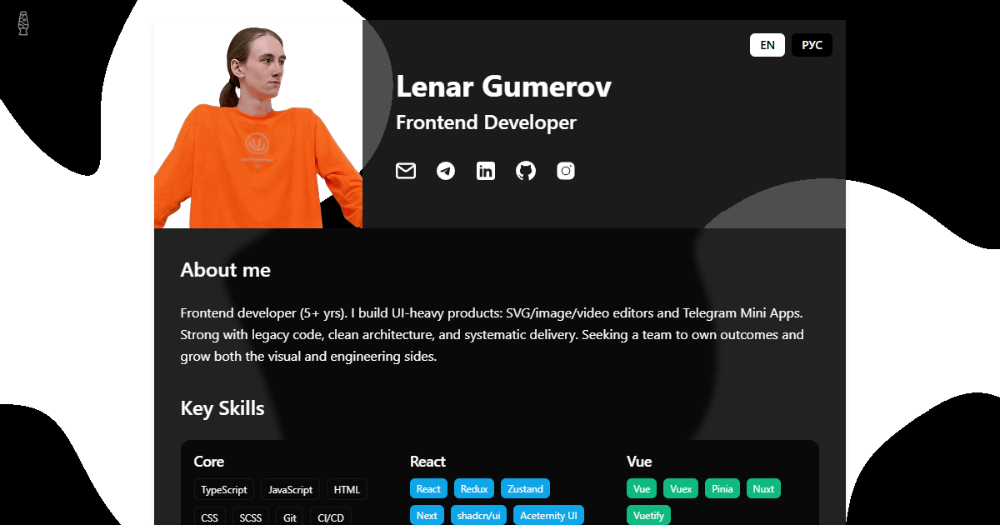

# Interactive CV

A modern, interactive CV/resume website built with Astro and React, featuring a clean design, interactive elements, and multi-language support.



<!-- 
To add a preview image, place a screenshot of your CV in the public directory:
public/cv-preview.png 
-->

## 🌟 Features

- **Responsive Design**: Looks great on all devices from mobile to desktop
- **Interactive Elements**: Animated background, smooth transitions, and interactive components
- **Multi-language Support**: Easily switch between English and Russian
- **Print-friendly Layout**: Optimized for PDF generation and printing
- **Animated Noise Background**: Dynamic bubble pattern
- **Accessibility Focused**: Follows best practices for screen readers and keyboard navigation

## 🛠️ Tech Stack

- **[Astro](https://astro.build/)**: Core framework for static site generation
- **[React](https://reactjs.org/)**: For interactive components
- **[TypeScript](https://www.typescriptlang.org/)**: For type-safe code
- **[Tailwind CSS](https://tailwindcss.com/)**: For styling
- **[Motion](https://motion.dev/)**: For smooth animations and transitions
- **WebGL2 (GLSL shaders)**: GPU-accelerated background animation

## 🚀 Getting Started

### Prerequisites

- Node.js (v20+)
- pnpm (recommended) or npm

### Installation

1. Install dependencies:

   ```bash
   pnpm install
   ```

2. Start the development server:

   ```bash
   pnpm dev
   ```

3. Open your browser and navigate to `http://localhost:4321/CV/`

## 🫧 Background Animation (WebGL)

The background is rendered on a `<canvas>` using WebGL2 and a GLSL fragment shader that generates animated simplex noise. It runs efficiently on the GPU, supports subtle parallax to mouse and scroll, and respects accessibility and performance best practices.

- **Implementation**: See `src/components/NoiseBackground.tsx`. It renders a fullscreen triangle and shades fragments with 3D simplex noise, thresholded to produce a soft bubble pattern. Mounted in `src/layouts/Layout.astro` via `<NoiseBackground client:idle />`.
- **Interaction**: Mouse movement and page scroll apply a light parallax effect. Animation starts on browser idle and pauses when the tab is not visible.
- **Accessibility & Fallbacks**:
  - Honors `prefers-reduced-motion` by rendering a static frame.
  - If WebGL2 is unavailable, the component falls back to the page’s CSS background (no script errors).
  - Hidden in print via `print:hidden`.
- **Customization**:
  - **Colors**: Controlled via the canvas classes `text-noise-primary` and `bg-noise-secondary` (see Tailwind setup). Update these theme colors to restyle the effect.
  - **Density/Scale**: Tweak `u_threshold` and `u_noiseScale` in `NoiseBackground.tsx` to change blob density and size.
  - **Parallax feel**: Adjust `parallaxIntensity`, `scrollParallaxIntensity`, and `lerpFactor` constants in `NoiseBackground.tsx`.
- **Disable**: Remove or comment out `<NoiseBackground client:idle />` in `src/layouts/Layout.astro` if you want a static background.

## 📋 Project Structure

```text
/
├── public/            # Static assets
├── src/
│   ├── components/    # React components
│   ├── data/          # CV data (experiences, education, skills)
│   ├── i18n/          # Translation files
│   ├── layouts/       # Astro layouts
│   ├── pages/         # Astro pages
│   ├── styles/        # Global CSS
│   └── utils/         # Utility functions
├── astro.config.mjs   # Astro configuration
├── tailwind.config.js # Tailwind configuration
└── tsconfig.json      # TypeScript configuration
```

## 🌐 Customization

### Content

To customize the CV content, edit the files in the `src/data/` directory:

- `personal-info.ts`: Your personal information and social links
- `experiences.ts`: Your work experience
- `education.ts`: Your educational background
- `achievements.ts`: Your achievements
- `tags.ts`: Your used technologies

### Translations

To modify or add translations, edit the files in the `src/i18n/` directory:

- `en.js`: English translations
- `ru.js`: Russian translations

To add a new language, create a new file (e.g., `fr.js`) and update the `index.js` file to include it.

### Styling

The project uses Tailwind CSS for styling. The main configuration is in `tailwind.config.mjs`.

The color scheme can be customized by editing:

- Primary color (black): `#0A0A0A`
- Secondary color (light gray): `#F5F5F5`

## 🔄 Translation System

The project features a robust translation system that supports:

- Personal information
- Section titles
- Experience and education details
- Date formatting according to locale
- UI elements

Translations are stored in key-value pairs and accessed via a React context.

## 🖨️ Printing

The CV is optimized for printing to PDF:

1. Open the website in Chrome
2. Press `Ctrl+P` (or `Cmd+P` on Mac)
3. Set destination to "Save as PDF"
4. Click "Save"

## 📱 Responsive Design

The CV is fully responsive and optimized for:

- Mobile phones
- Tablets
- Desktops
- Print media

## 🤝 Contributing

Contributions are welcome! Please feel free to submit a Pull Request.

## 📄 License

This project is licensed under the MIT License - see the [LICENSE](LICENSE) file for details.
